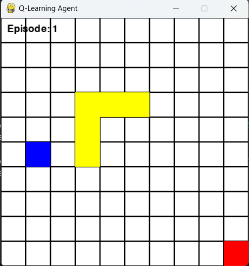

# README

## Q-Learning Maze Solver

This project implements a Q-Learning agent to solve a maze using the Pygame library for visualization.

<p align="center">

</p>
### Requirements

- Python 3.x
- Pygame
- NumPy

### Installation

1. Clone the repository:

   ```bash
   git clone https://github.com/yourusername/q-learning-maze-solver.git

   ```

2. Navigate to the project directory:

   ```bash
   cd q-learning-maze-solver
   ```

3. Install the required packages:
   ```bash
   pip install -r requirements.txt
   ```

### Usage

Run the script to start training and visualizing the Q-Learning agent:

```python
python maze.py
```

### How It Works

1. The maze is represented as a grid with obstacles.
2. The Q-Learning agent starts at the top-left corner and aims to reach the bottom-right corner.
3. The agent explores the maze and updates its Q-table based on the rewards received.
4. The training process is visualized using Pygame.

### Constants

- `/WHITE/`: Color for the background.
- `/BLUE/`: Color for the agent.
- `/BLACK/`: Color for the grid lines.
- `/RED/`: Color for the goal.
- `/YELLOW/`: Color for the obstacles.
- `/CELL_SIZE/`: Size of each cell in the grid.
- `/GRID_SIZE/`: Size of the grid.

### Functions

- `draw_maze()`: Draws the maze grid, goal, and obstacles.
- `get_next_position(pos, action)`: Calculates the next position of the agent based on the current position and action.
- `train_and_visualize()`: Trains the Q-Learning agent and visualizes the process using Pygame.

### License

This project is licensed under the MIT License. See the LICENSE file for details.

### Acknowledgements

- Pygame: `https://www.pygame.org`
- NumPy: `https://numpy.org`

Feel free to contribute to this project by opening issues or submitting pull requests.
